# **HELM CHARTS REPO**

Repositorios de charts Local y Público.

**REPO LOCAL**

Tener en consideración, un dockerfile, crear la imagen con el tag correspondiente y luego, enviarlo (push) a algún repo de imágenes (docker hub).

* Para crear chart, primeramente se debe descargar la plantilla:

  ```
  helm create <name app> 
  ```

  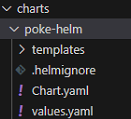
* Modificar los valores correspondientes en las plantillas generadas, charts.yml para descripcion de la app y en values.yml, para modificar image, replicas, services, ports, etc:

  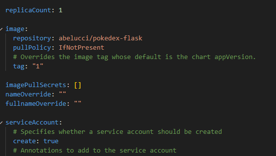

  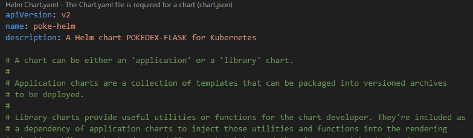
* Verificación:

  ```
  helm list -a
  ```
* Instalar chart en localhost:

  ```
  helm install <name replease> <name chart>
  helm install edu-it ./poke-helm
  ```

  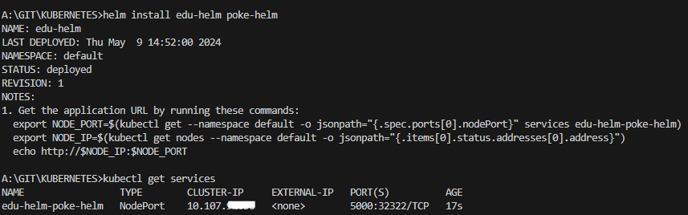

  La aplicación funciona correctamente.

  # **REPO PÚBLICA EN GITHUB**
* Crear repo, agregar rama "gh-pages" y habilitar github pages para que inicie en la rama recién creada.
* Crear la siguiente estructura:

  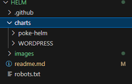

  Dentro de la carpeta charts, almacenar los charts creados anteriormente, ya que dentro de ella, se encuentran todos los archivos que se van a utilizar para empaquetar los artefactos (charts).
* Clonar repo en nuestro localhost.
* Verificar los charts locales:

  ```
  helm lint <path chart>
  helm lint ./chart/poke-helm
  ```
* Agregar .txt, para evadir busquedas en el repo:

  ```
  echo -e “User-Agent: *\nDisallow: /” > robots.txt
  ```

  Se puede seguir dos caminos, crear el paquete, agregar un index de metadatos y subirlo manualmente al repo o, crear un pipeline para que realice este trabajo cada vez que agreguemos un chart nuevo o que modifiquemos el chart.

  # **CREACIÓN DE PAQUETE MANUAL & PUSH A GITHUB**
* Crear empaquetado:

  ```
  helm package <path chart>
  helm package ./poke-helm
  ```
* Crear index.yml para el repositorio helm

  ```
  helm repo index --url <github repositorio> .
  helm repo index --url https://abelucci.github.io/helm .
  ```

  Todo esto se sincroniza en github para poder acceder al paquete.
  Resta agregar repo a mi lista de repo helm en localhost

  # **CREACIÓN DE PAQUETE POR PIPELINE GITHUB ACTIONS**

  Primeramente crear workflow para tener automatización a la hora de crear el paquete y el index.yml. Habilitar tambien permisos para workflow, ya que por default, los permisos estan en "read".
* Crear en la siguiente estructura el pipeline:

  ```
  .github/workflows/release.yml
  ```

  ```
  name: Release Helm Charts
  on:
    push:
      branches:
        - main

  jobs:
    release:
      runs-on: ubuntu-latest
      steps:
        - name: Checkout
          uses: actions/checkout@v4
          with:
            fetch-depth: 0
        - name: Configure Git user
          run: |
            git config user.name "$GITHUB_ACTOR"
            git config user.email "$GITHUB_ACTOR@users.noreply.github.com"
        - name: Run chart-releaser job
          uses: helm/chart-releaser-action@v1.6.0
          env:
            CR_TOKEN: "${{ secrets.GHA_TOKEN }}"
  ```

  Se debe crear, además, el token de github para poder realizar las automatizaciones.

  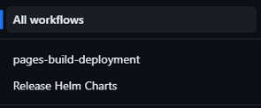
* En la carpeta ./charts mover todos los charts creados anteriormente, y en ese momento, el pipeline va a crear automaticamente el archivos index.yml y el paquete .tgz correspondiente a cada release que enviemos mediante push, estos cambios se van a encontrar en la rama "gh-pages", /charts:

  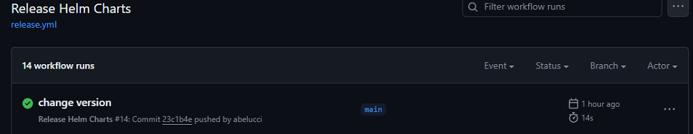

  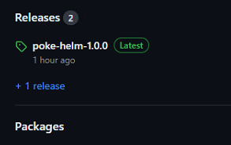

  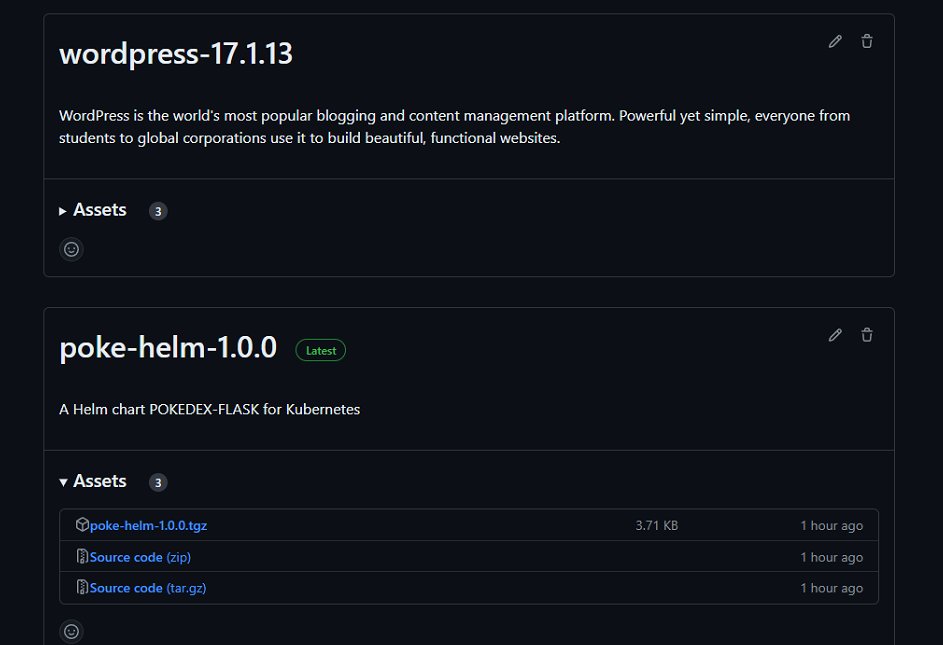

  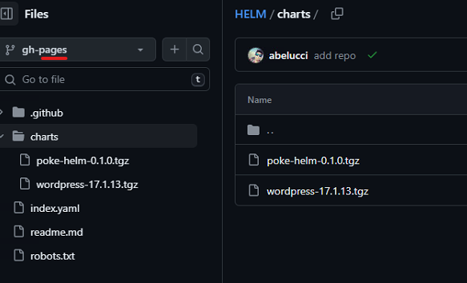

  # A**GREGAR REPO A LA LISTA DE REPOSITORIOS HELM**

  Por último, agregar el repositorio para poder acceder a todos los paquetes creados:
* Agregar repo:

  ```
  helm repo add <name repo> https://abelucci.github.io/HELM/
  ```
* Listar, actualizar & buscar paquetes:

  ```
  helm repo list
  helm repo update
  helm search repo <name repo>
  ```

  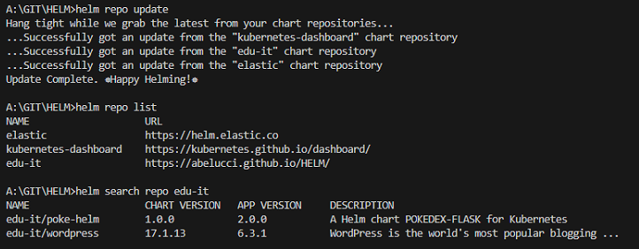

  # **INSTALAR CHART**

  Por último, instalar el paquete:
* Creación e implementación:

  ```
  helm install <name release> <name repositorio helm en github>
  helm install test edu-it/poke-helm
  ```

  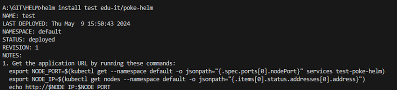

  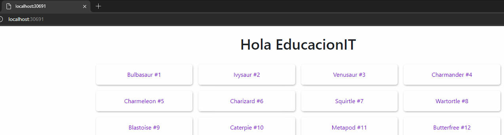

  # **REPOSITORIO HELM CHART EN GITHUB PAGES**

  Para poder modificar este readme, se debe user el que se encuentra en la rama "gh-pages".

  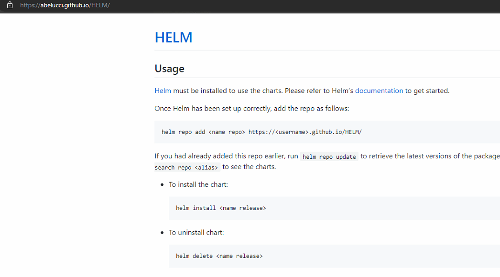

# **CHART WORDPRESS**

Descargar chart desde la pagina oficial de bitnami

* Sitio:[https://bitnami.com/stack/wordpress/helm](https://bitnami.com/stack/wordpress/helmhttps://)
  [https://github.com/bitnami/charts/tree/main/bitnami/wordpress/#installing-the-chart](https://github.com/bitnami/charts/tree/main/bitnami/wordpress/#installing-the-charthttps://)
* Comandos para instalar:

  ```
  helm install wps --set service.type=NodePort oci://registry-1.docker.io/bitnamicharts/wordpress 
  ```
* Luego, verificar el puerto en donde se publica el servicio para visualizarlo en el navegador:

  ```
  kubectl get svc
  ```
* Para poder conectar a mariaDB, modificar el *services *para que puede ser expuesto por fuera del cluster (nodePort):

  ```
   kubectl edit svc/registry
   kubectl edit svc/wps-mariadb  
  ```
* Verificar clave mariaDB:

  ```
  kubectl get secret --namespace default wps-mariadb -o jsonpath="{.data.mariadb-root-password}" | base64 --decode
  ```

  El usuario es es root y la tabla es bitnami_wordpress

# **BIBLIOGRAFÍA**

* [https://www.opcito.com/blogs/creating-helm-repository-using-github-pages](https://www.opcito.com/blogs/creating-helm-repository-using-github-pages)
* https://praveeng-nair.medium.com/host-your-helm-chart-repo-on-github-d189bf19fe60
